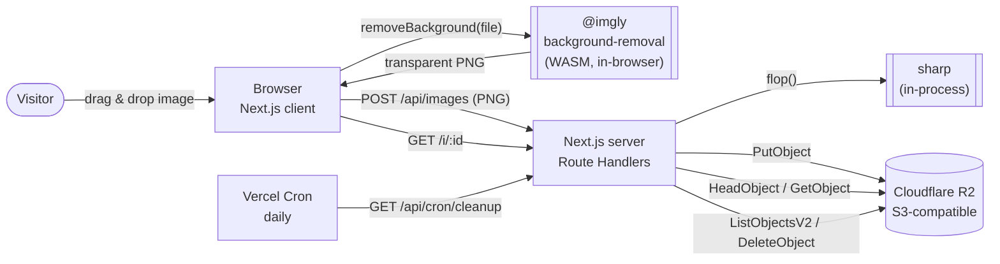
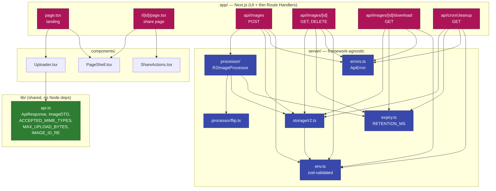
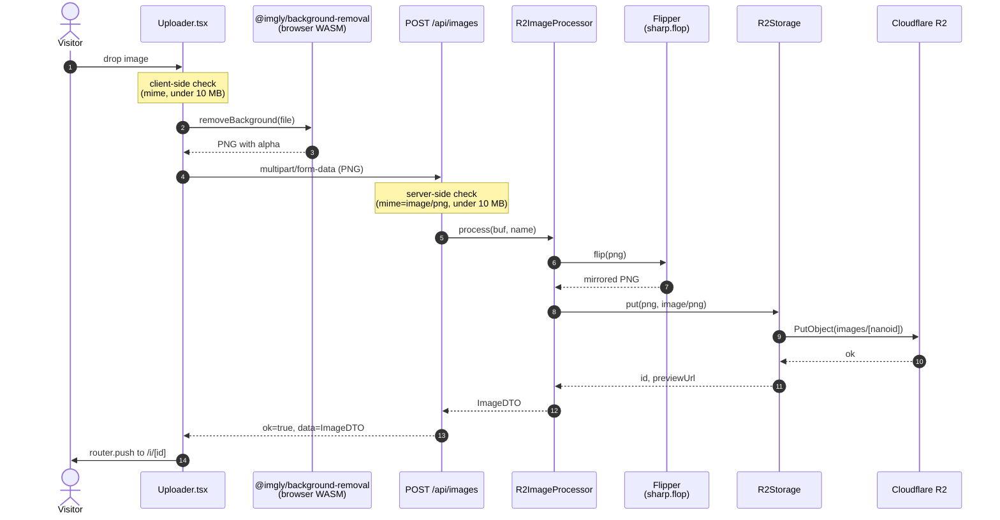
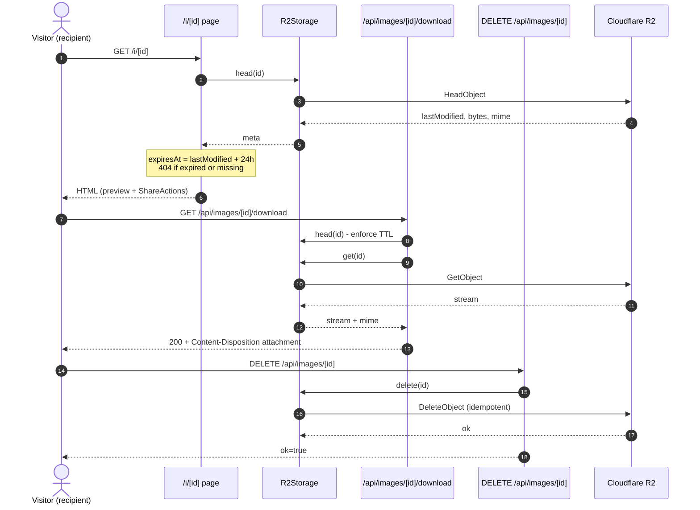
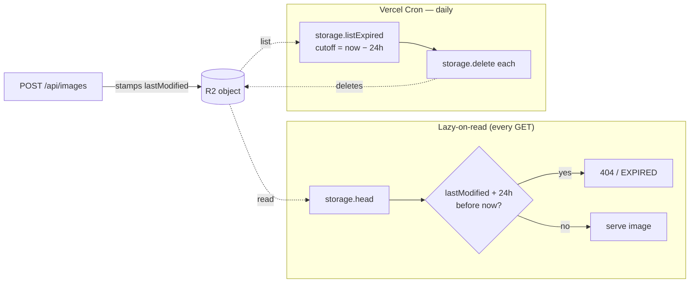

# Architecture

A bird's-eye view of how the **MirrorMe** image transformation app is wired together.

For the *why* behind these decisions, see the [PRD](PRD.md). For the slice-by-slice history of how it was built, see [docs/issues/done/](issues/done/).

---

## 1. System context

What the app talks to from outside.



**Key external dependencies**

| Concern | Choice | Why |
|---|---|---|
| Background removal | `@imgly/background-removal` (browser, WASM) | Runs in the visitor's browser. Zero quota, zero server CPU, no API key. |
| Image processing | `sharp` | `.flop()` is the simplest possible horizontal flip. |
| Storage | Cloudflare R2 | S3-compatible, **zero egress** — every download streams through us. |
| Hosting | Vercel | Native Next.js, built-in Cron, generous free tier. |

---

## 2. Module layout

The codebase enforces one structural rule: **`server/` never imports from `next/*`.** Route Handlers in `app/api/**` are thin adapters that translate HTTP into calls on framework-agnostic modules.



**Single integration seams.** Each external dependency sits behind a small public interface that hides a much larger implementation. `R2ImageProcessor.process(buf, mime, name)` is the only entry point for the server-side `flip → upload` pipeline; Route Handlers don't know `sharp` exists. Same pattern for `R2Storage` (hides the S3 SDK) and `Flipper` (hides sharp's pipeline). On the client, `Uploader.tsx` lazy-loads `@imgly/background-removal` and only after the model returns a transparent PNG does it POST to the server. The payoff: swapping any single provider is a one-file change, and tests mock the narrow interface instead of the SDK underneath.

---

## 3. Upload flow (the happy path)



Every error along the way is mapped to a typed `ErrorCode` (`INVALID_FILE`, `STORAGE_FAILED`, …) by `toErrorResponse()` so the underlying error message never leaks to the client. Background-removal errors now surface in the browser before the network request is made.

---

## 4. Share + download flow

The share page (`/i/[id]`) is a Server Component. It calls `storage.head(id)` to derive `expiresAt` from R2's `LastModified` and to short-circuit with a 404 for expired or missing objects.



---

## 5. Retention &amp; cleanup

There is **no** metadata store. R2's `LastModified` is the source of truth for `expiresAt`. Two mechanisms together guarantee an image is never visible past its TTL:



Belt-and-braces: even if cron is delayed, the lazy check guarantees a stale image never renders.

The cleanup endpoint is protected by a constant-time `Bearer $CRON_SECRET` compare so attackers can't brute-force the secret via response-time side channels.

---

## 6. Error envelope

Every Route Handler returns the same shape, defined once in [`src/lib/api.ts`](../src/lib/api.ts):

```ts
type ApiResponse<T> =
  | { ok: true; data: T }
  | { ok: false; error: { code: ErrorCode; message: string } };
```

`server/errors.ts` owns the mapping from `ApiError` → HTTP status + safe message; underlying error details are logged server-side but never surfaced to the client.

---

## 7. Where to look first

| If you want to… | Start at |
|---|---|
| Trace a single upload end-to-end | [`Uploader.tsx`](../src/components/Uploader.tsx) → [`api/images/route.ts`](../src/app/api/images/route.ts) → [`r2-image-processor.ts`](../src/server/processor/r2-image-processor.ts) |
| Understand the share page | [`app/i/[id]/page.tsx`](../src/app/i/[id]/page.tsx) + [`ShareActions.tsx`](../src/app/i/[id]/ShareActions.tsx) |
| Add a new storage backend | Implement the `R2Storage`-shaped interface in [`server/storage/r2.ts`](../src/server/storage/r2.ts) |
| Swap the bg-removal provider | Edit the imgly call inside [`components/Uploader.tsx`](../src/components/Uploader.tsx) (or move it back server-side by reintroducing a `BackgroundRemover` seam in `R2ImageProcessor`) |
| Tune retention | [`server/expiry.ts`](../src/server/expiry.ts) — single `RETENTION_MS` constant |

---

## 8. Tradeoffs

Why each piece of the stack was chosen, what it cost, and what we'd reach for if requirements changed.

### Background removal — `@imgly/background-removal` (browser, WASM)

| Considered | Verdict |
|---|---|
| **Browser-side `@imgly/background-removal`** ✅ | Runs in the visitor's browser via WASM (and WebGPU when available). Zero server CPU, zero quota, no API key. The Vercel lambda doesn't need the 250 MB native ORT bundle anymore. |
| Server-side `@imgly/background-removal-node` | Original choice (PR #14). Hit a ~14 s CPU floor on a warm Vercel lambda — model inference is the floor and there's no caching/ORT-tuning that beats it. |
| remove.bg / Photoroom / Pixian | Better quality on hard cases, but free tiers are 50–100 images/month and require an account + API key. Disqualified by the "no paid usage" constraint. |

**Cost:** the model is ~22 MB (`isnet_quint8`) plus ~10 MB of WASM. We preload on first user intent (hover, focus, drag-enter) so it usually finishes before the visitor picks a file, and we render an explicit progress bar otherwise. Old/low-end devices may struggle — fallback to a SaaS provider would be a one-component change.

**Swap path:** edit the imgly call inside [`components/Uploader.tsx`](../src/components/Uploader.tsx). To move bg-removal back to the server, reintroduce the previous `BackgroundRemover` seam in [`r2-image-processor.ts`](../src/server/processor/r2-image-processor.ts).

### Image flip — `sharp`

`sharp().flop()` is one method call backed by libvips (C). Considered native `<canvas>` on the client (would mean no server round trip for the flip itself, but we already have the buffer server-side after bg-removal, so flipping there is free). Considered ImageMagick (heavier, slower, no perf upside for a single op).

### Storage — Cloudflare R2

| Considered | Verdict |
|---|---|
| **Cloudflare R2** ✅ | S3-compatible API (so `@aws-sdk/client-s3` works unchanged), **zero egress fees**, generous free tier (10 GB stored, 10M Class-A ops/month). Egress matters because every download streams through us. |
| AWS S3 | Identical API, but egress is $0.09/GB after 100 GB/month. For a public-share use case that's a footgun. |
| Supabase Storage / UploadThing | Bundled DX is nice, but tighter free tiers and proprietary SDKs lock us in. |
| Cloudinary | Image-aware (transformations on the URL!), but free tier is credit-based and the SDK pulls in a lot. Overkill for "store and serve". |
| Vercel Blob | Same vendor as the runtime, but billed per GB egress with no free allowance and a smaller free storage tier. |

**Cost:** R2 needs four env vars (account id, key id, secret, bucket) plus a public base URL. The S3 SDK is ~3 MB in node_modules. Worth it.

### Metadata store — none

| Considered | Verdict |
|---|---|
| **None** ✅ | R2's `LastModified` header is the only state we need to compute `expiresAt`. Adding a database would just duplicate it. |
| SQLite / `better-sqlite3` | Originally planned, then dropped: the only column we'd write is `createdAt`, and R2 already has it. Persistence on Vercel would also need a mounted volume. |
| Postgres / Neon | Same conclusion, with extra latency. |

**Cost:** we lose the ability to do richer queries ("how many images uploaded today?"). For an anonymous, single-purpose tool with a 24h retention, that's not a feature.

### Cleanup — Vercel Cron + lazy-on-read

| Considered | Verdict |
|---|---|
| **Both** ✅ | Cron runs daily and physically deletes objects past TTL. Lazy-on-read also short-circuits any GET for an expired object. If cron is delayed (or fails for a day), users still never see a stale image. |
| Cron only | Fails open: a delayed run means stale images keep rendering. |
| Lazy-on-read only | Fails closed but never reclaims storage. Bytes accumulate until the bucket fills. |
| S3 Lifecycle / R2 object expiry | Cleaner, but R2's lifecycle rules don't expose a simple "X hours after upload" knob with sub-day precision (rules run on a daily schedule). We'd still need lazy-on-read for the precision, so adding lifecycle would be a third moving part with no extra guarantee. |

**Cost:** the cron endpoint scans the whole `images/` prefix every day — fine at our scale, would need pagination for millions of objects.

### Hosting — Vercel

Native Next.js, built-in Cron, `git push` deploy, generous free tier. Considered Render / Fly / Railway — all viable, but Cron and the App Router story are first-class on Vercel. The Hobby tier's 4.5 MB request-body limit is the one real constraint and it caps our `MAX_UPLOAD_BYTES` at 10 MB *before* multipart overhead — well within range.

### Framework — Next.js (App Router) + TypeScript strict

App Router gives us Server Components for the share page (so the recipient gets HTML that already knows the image's metadata, no client fetch round trip) plus Route Handlers for the API surface. TypeScript is strict so the `ApiResponse<T>` discriminated union is enforced at every call site.

Considered a split: a separate Hono / Fastify backend + a Vite SPA. More moving parts, two deploys, two `package.json`s — not justified for a single-screen tool. The `app/` vs `server/` split inside one repo gives the same architectural clarity, and `server/` carries a lint rule that forbids `next/*` imports so the boundary holds.

### ID generation — `nanoid` (10-char URL-safe)

Considered UUID v4 (longer, uglier in URLs), incrementing integers (predictable / scrapable), `crypto.randomUUID()` (fine, but again 36 chars). 10 chars at 64 alphabet = 64¹⁰ ≈ 10¹⁸ space; collision-free for our scale and pretty in `/i/Vx7BkLm9Qa`.

### Testing — Vitest + V8 coverage

Considered Jest. Vitest is faster, has native ESM/TS support, and `@vitest/coverage-v8` is one config block. No reason to take the Jest hit.

### Package manager — pnpm

`sharp` ships platform-specific binaries; pnpm's strict dependency resolution surfaces missing peers loudly instead of silently picking up a hoisted version. The `pnpm.onlyBuiltDependencies` allowlist also gives us explicit control over which postinstall scripts run.

### Styling — Tailwind v4

`@theme inline` lets us declare design tokens once in CSS and use them as Tailwind utilities (`bg-primary`, `text-on-surface`) without a JS config file. Considered CSS Modules (more boilerplate) and styled-components (runtime cost on Server Components is fragile).

