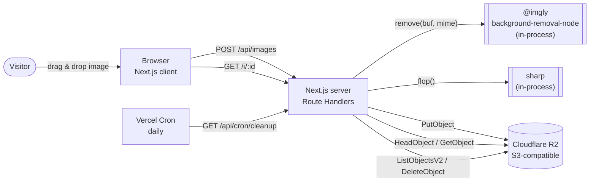
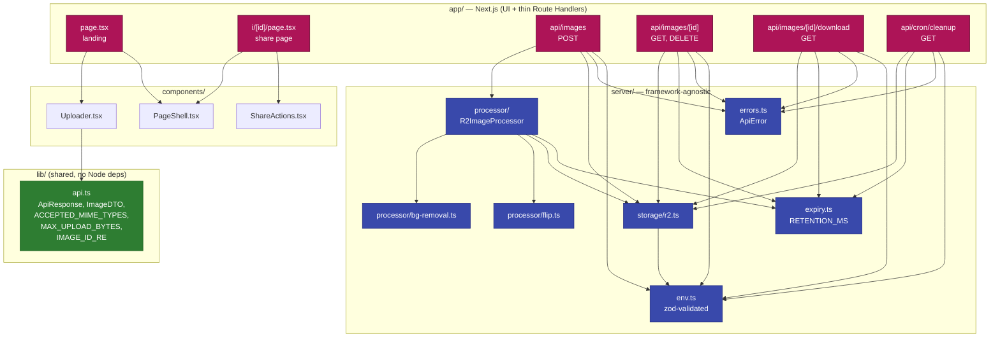
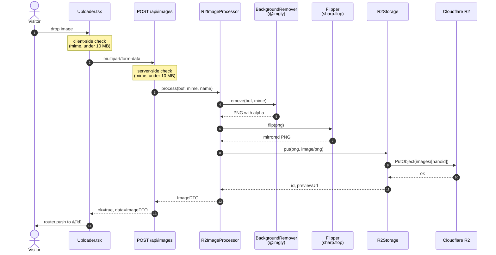
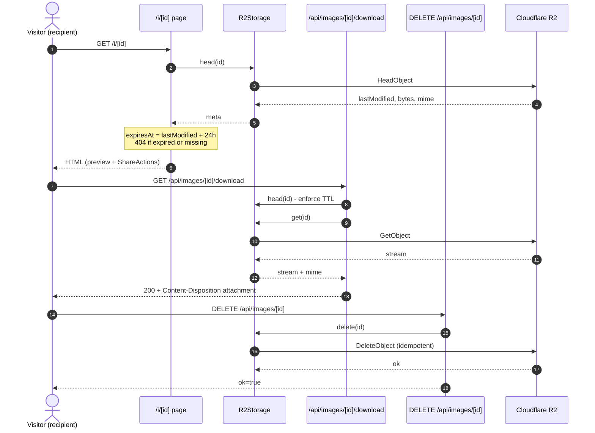
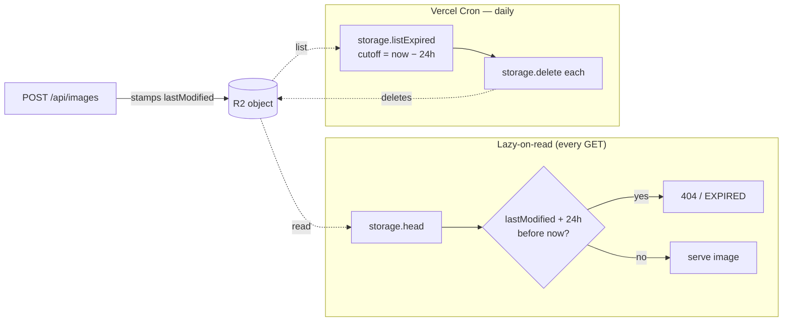

# Architecture

A bird's-eye view of how the **MirrorMe** image transformation app is wired together.

For the *why* behind these decisions, see the [PRD](PRD.md). For the slice-by-slice history of how it was built, see [docs/issues/done/](issues/done/).

---

## 1. System context

What the app talks to from outside.



**Key external dependencies**

| Concern | Choice | Why |
|---|---|---|
| Background removal | `@imgly/background-removal-node` (local) | Zero quota, no API key to leak, runs in-process. |
| Image processing | `sharp` | `.flop()` is the simplest possible horizontal flip. |
| Storage | Cloudflare R2 | S3-compatible, **zero egress** — every download streams through us. |
| Hosting | Vercel | Native Next.js, built-in Cron, generous free tier. |

---

## 2. Module layout

The codebase enforces one structural rule: **`server/` never imports from `next/*`.** Route Handlers in `app/api/**` are thin adapters that translate HTTP into calls on framework-agnostic modules.



**Deep modules.** `R2ImageProcessor.process(buf, mime, name)` is the single seam for the entire `bg-removal → flip → upload` pipeline. Route Handlers don't know anything about `sharp` or `@imgly`.

---

## 3. Upload flow (the happy path)



Every error along the way is mapped to a typed `ErrorCode` (`INVALID_FILE`, `BG_REMOVAL_FAILED`, `STORAGE_FAILED`, …) by `toErrorResponse()` so the underlying error message never leaks to the client.

---

## 4. Share + download flow

The share page (`/i/[id]`) is a Server Component. It calls `storage.head(id)` to derive `expiresAt` from R2's `LastModified` and to short-circuit with a 404 for expired or missing objects.



---

## 5. Retention &amp; cleanup

There is **no** metadata store. R2's `LastModified` is the source of truth for `expiresAt`. Two mechanisms together guarantee an image is never visible past its TTL:



Belt-and-braces: even if cron is delayed, the lazy check guarantees a stale image never renders.

The cleanup endpoint is protected by a constant-time `Bearer $CRON_SECRET` compare so attackers can't brute-force the secret via response-time side channels.

---

## 6. Error envelope

Every Route Handler returns the same shape, defined once in [`src/lib/api.ts`](../src/lib/api.ts):

```ts
type ApiResponse<T> =
  | { ok: true; data: T }
  | { ok: false; error: { code: ErrorCode; message: string } };
```

`server/errors.ts` owns the mapping from `ApiError` → HTTP status + safe message; underlying error details are logged server-side but never surfaced to the client.

---

## 7. Where to look first

| If you want to… | Start at |
|---|---|
| Trace a single upload end-to-end | [`Uploader.tsx`](../src/components/Uploader.tsx) → [`api/images/route.ts`](../src/app/api/images/route.ts) → [`r2-image-processor.ts`](../src/server/processor/r2-image-processor.ts) |
| Understand the share page | [`app/i/[id]/page.tsx`](../src/app/i/[id]/page.tsx) + [`ShareActions.tsx`](../src/app/i/[id]/ShareActions.tsx) |
| Add a new storage backend | Implement the `R2Storage`-shaped interface in [`server/storage/r2.ts`](../src/server/storage/r2.ts) |
| Swap the bg-removal provider | Replace [`server/processor/bg-removal.ts`](../src/server/processor/bg-removal.ts) (the public `remove(buf, mime)` shape is the contract) |
| Tune retention | [`server/expiry.ts`](../src/server/expiry.ts) — single `RETENTION_MS` constant |
