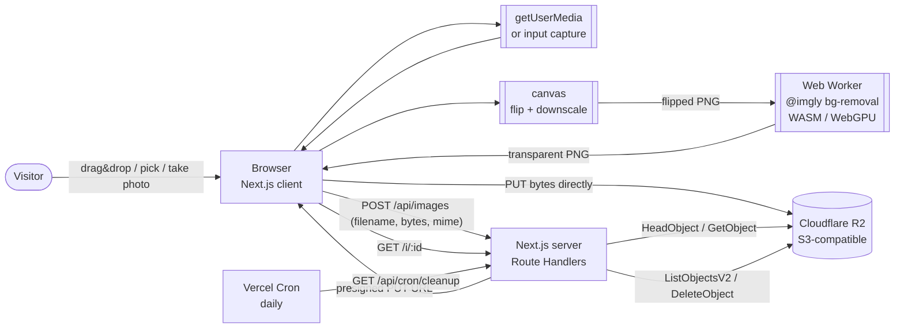
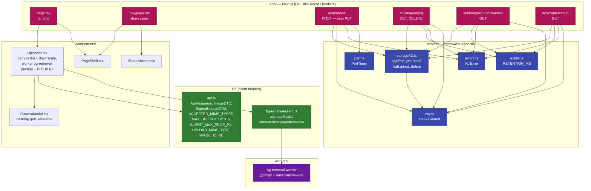
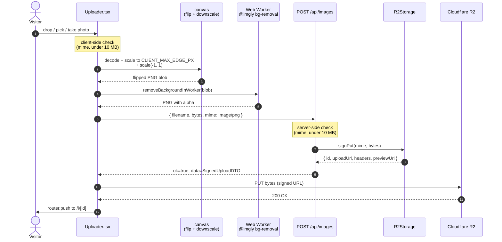
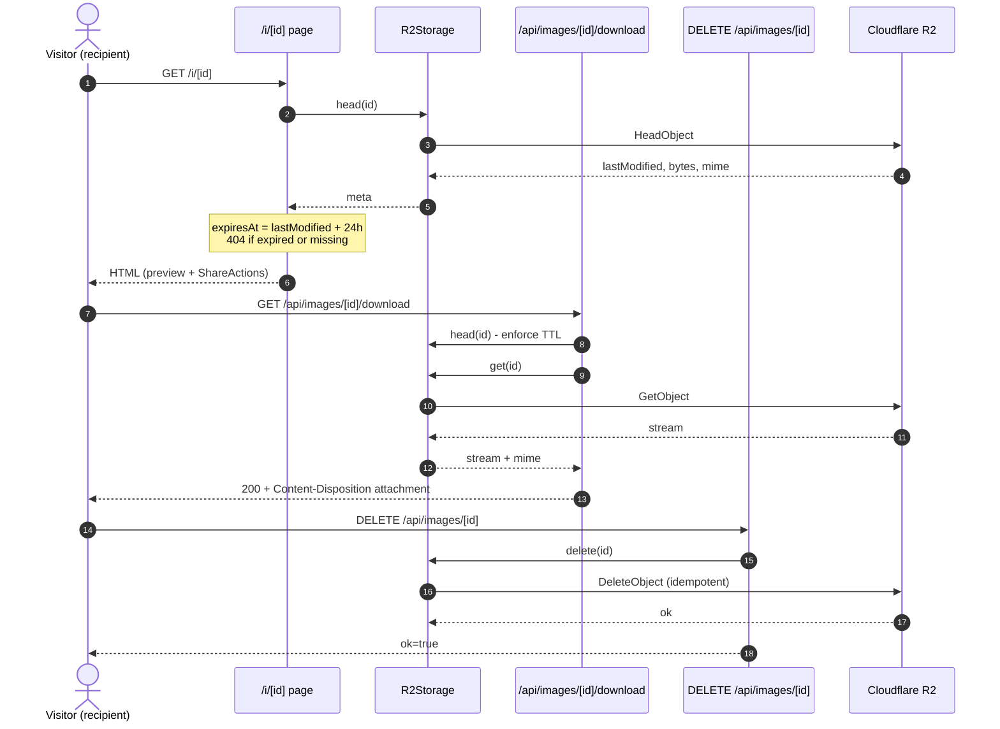
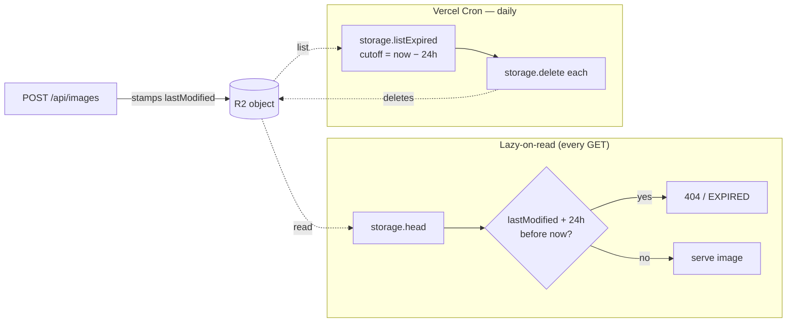

# Architecture

A bird's-eye view of how the **MirrorMe** image transformation app is wired together.

For the *why* behind these decisions, see the [PRD](PRD.md). For the slice-by-slice history of how it was built, see [docs/issues/done/](issues/done/).

---

## 1. System context

What the app talks to from outside.



**Key external dependencies**

| Concern | Choice | Why |
|---|---|---|
| Background removal | `@imgly/background-removal` (browser, WASM, **inside a Web Worker**) | Runs in the visitor's browser. Zero server CPU, zero quota, no API key. Worker keeps the main thread free for animation. |
| Horizontal flip | Browser `<canvas>` `scale(-1, 1)` | Done in the same pass that downscales the image to `CLIENT_MAX_EDGE_PX`. No native binary, no server CPU. |
| Image upload | **Direct-to-R2 presigned PUT** | Server signs a one-shot URL; bytes never traverse our serverless function, so we sidestep Vercel's 4.5 MB body limit. |
| Storage | Cloudflare R2 | S3-compatible, **zero egress** — every download streams through us. |
| Hosting | Vercel | Native Next.js, built-in Cron, generous free tier. |

---

## 2. Module layout

The codebase enforces one structural rule: **`server/` never imports from `next/*`.** Route Handlers in `app/api/**` are thin adapters that translate HTTP into calls on framework-agnostic modules. After the move to client-side processing + direct-to-R2 uploads, the server is essentially just an authenticator/signer for R2.



**Single integration seams.** Each external dependency sits behind a small public interface that hides a much larger implementation. On the server, `R2Storage` is the only seam left — Route Handlers don't know `@aws-sdk/client-s3` exists. On the client, `bg-removal-client.ts` (`warmupModel`, `removeBackgroundInWorker`) hides the `@imgly` model and the Web Worker plumbing, and `Uploader.tsx` does the canvas-based flip in the same pass that downscales to `CLIENT_MAX_EDGE_PX`. The payoff: swapping any single provider is a one-file change, and tests mock the narrow interface instead of the SDK underneath.

---

## 3. Upload flow (the happy path)



Server-side errors are mapped to a typed `ErrorCode` (`INVALID_FILE`, `STORAGE_FAILED`, …) by `toErrorResponse()` so the underlying error message never leaks to the client. Client-side errors (model load, bg-removal, canvas encode, R2 PUT) surface inline in the uploader before any further step runs.

### Progress UX

The uploader renders a single 0→100% bar across all phases plus a stage-aware headline. Two design calls are worth flagging:

- **Time-based, not event-based.** The bar is driven entirely by [`createSmoothProgress`](../src/lib/smooth-progress.ts) — a linear climb from 0 to 95% over an estimated total duration, snapping to 100% only when the whole pipeline actually finishes. Real progress events from the underlying phases (model download, bg-removal, R2 PUT) intentionally do **not** feed the displayed value: bg-removal emits no events on a warm cache and the R2 PUT bursts events at the very end, so mixing them in produced the classic "stall at 60% then sprint to 100" feel. Driving the bar from time alone gives a uniform pace at the cost of numerical accuracy.
- **Self-calibrating ETA.** [`PhaseEtaTracker`](../src/lib/smooth-progress.ts) keeps an EMA of each phase's wall-clock duration (warmup / bgRemove / upload) so the next upload's total ETA matches reality — the first upload uses defaults, and subsequent ones adapt to the visitor's device + network.
- **Stage-aware copy.** The headline rotates inside a per-stage list (`warmup` → `removing` → `uploading`) defined in `Uploader.tsx`. Each list mixes one plain "what's happening" line with sillier ones, and the headline jumps to a fresh random message the instant the pipeline advances, so a stage transition is visible even if the bar happens to be mid-climb.

---

## 4. Share + download flow

The share page (`/i/[id]`) is a Server Component. It calls `storage.head(id)` to derive `expiresAt` from R2's `LastModified` and to short-circuit with a 404 for expired or missing objects.



---

## 5. Retention &amp; cleanup

There is **no** metadata store. R2's `LastModified` is the source of truth for `expiresAt`. Two mechanisms together guarantee an image is never visible past its TTL:



Belt-and-braces: even if cron is delayed, the lazy check guarantees a stale image never renders.

The cleanup endpoint is protected by a constant-time `Bearer $CRON_SECRET` compare so attackers can't brute-force the secret via response-time side channels.

---

## 6. Error envelope

Every Route Handler returns the same shape, defined once in [`src/lib/api.ts`](../src/lib/api.ts):

```ts
type ApiResponse<T> =
  | { ok: true; data: T }
  | { ok: false; error: { code: ErrorCode; message: string } };
```

`server/errors.ts` owns the mapping from `ApiError` → HTTP status + safe message; underlying error details are logged server-side but never surfaced to the client.

---

## 7. Where to look first

| If you want to… | Start at |
|---|---|
| Trace a single upload end-to-end | [`Uploader.tsx`](../src/components/Uploader.tsx) (canvas flip + worker bg-removal) → [`api/images/route.ts`](../src/app/api/images/route.ts) (presign) → R2 PUT |
| Add live camera capture / debug it | [`CameraModal.tsx`](../src/components/CameraModal.tsx) (desktop `getUserMedia`) + the `<input capture>` fallback inside [`Uploader.tsx`](../src/components/Uploader.tsx) |
| Understand the share page | [`app/i/[id]/page.tsx`](../src/app/i/[id]/page.tsx) + [`ShareActions.tsx`](../src/app/i/[id]/ShareActions.tsx) |
| Add a new storage backend | Implement the `R2Storage`-shaped interface in [`server/storage/r2.ts`](../src/server/storage/r2.ts) (must include `signPut`) |
| Swap the bg-removal provider | Edit [`lib/bg-removal-client.ts`](../src/lib/bg-removal-client.ts) and the worker under [`src/workers/`](../src/workers/) |
| Tune retention | [`server/expiry.ts`](../src/server/expiry.ts) — single `RETENTION_MS` constant |

---

## 8. Tradeoffs

Why each piece of the stack was chosen, what it cost, and what we'd reach for if requirements changed.

### Background removal — `@imgly/background-removal` (browser, WASM)

| Considered | Verdict |
|---|---|
| **Browser-side `@imgly/background-removal`** ✅ | Runs in the visitor's browser via WASM (and WebGPU when available). Zero server CPU, zero quota, no API key. The Vercel lambda doesn't need the 250 MB native ORT bundle anymore. |
| Server-side `@imgly/background-removal-node` | Original choice (PR #14). Hit a ~14 s CPU floor on a warm Vercel lambda — model inference is the floor and there's no caching/ORT-tuning that beats it. |
| remove.bg / Photoroom / Pixian | Better quality on hard cases, but free tiers are 50–100 images/month and require an account + API key. Disqualified by the "no paid usage" constraint. |

**Cost:** the model is ~44 MB (`isnet_fp16`) plus ~10 MB of WASM. We previously shipped the smaller `isnet_quint8` (~22 MB) but the int8 quantization noticeably softened hair / fur / fine edges; fp16 trades ~22 MB of cold bandwidth for a clear quality jump while staying WASM-friendly. We preload on first user intent (hover, focus, drag-enter) so the download usually finishes before the visitor picks a file, and the headline names "Loading background-removal model" otherwise. Inference runs in a Web Worker so the main thread can keep animating. Old/low-end devices may struggle — fallback to a SaaS provider would be a one-component change.

**Swap path:** edit [`lib/bg-removal-client.ts`](../src/lib/bg-removal-client.ts) and the worker source under [`src/workers/`](../src/workers/). To move bg-removal back to the server, restore the previous server-side processor seam and have `Uploader.tsx` POST the original file instead of the worker output.

### Image flip — client-side `<canvas>`

The horizontal flip is a one-liner: `ctx.translate(w, 0); ctx.scale(-1, 1); ctx.drawImage(...)`. We do it in the same canvas pass that downscales the input to `CLIENT_MAX_EDGE_PX` (so we pay decode/draw exactly once) and then encode to PNG via `canvas.toBlob`. Since we already had the bitmap in memory for downscaling, the flip is effectively free.

We used to do this server-side via `sharp().flop()` (libvips), but the move to client-side bg-removal made it the only thing left on the server-side processor — dropping `sharp` removed a ~12 MB native binary from the lambda and freed us from `pnpm.onlyBuiltDependencies` ceremony for it.

### Image upload — direct-to-R2 presigned PUT

| Considered | Verdict |
|---|---|
| **Direct-to-R2 via presigned PUT** ✅ | Server signs a one-shot URL with `@aws-sdk/s3-request-presigner`; the browser PUTs the bytes straight to R2 with progress reporting. Image bytes never traverse the Vercel function, so we are not bound by the 4.5 MB Hobby body limit. |
| Streaming `multipart/form-data` through the function | Original plan. Capped us at ~4.5 MB and burned function time proportional to bandwidth. |
| Vercel Blob direct uploads | Vendor-locked + paid egress; same UX cost. |

**Cost:** one extra round trip per upload (sign → PUT) and a small CORS dance on the R2 bucket. Worth it.

### Storage — Cloudflare R2

| Considered | Verdict |
|---|---|
| **Cloudflare R2** ✅ | S3-compatible API (so `@aws-sdk/client-s3` works unchanged), **zero egress fees**, generous free tier (10 GB stored, 10M Class-A ops/month). Egress matters because every download streams through us. |
| AWS S3 | Identical API, but egress is $0.09/GB after 100 GB/month. For a public-share use case that's a footgun. |
| Supabase Storage / UploadThing | Bundled DX is nice, but tighter free tiers and proprietary SDKs lock us in. |
| Cloudinary | Image-aware (transformations on the URL!), but free tier is credit-based and the SDK pulls in a lot. Overkill for "store and serve". |
| Vercel Blob | Same vendor as the runtime, but billed per GB egress with no free allowance and a smaller free storage tier. |

**Cost:** R2 needs four env vars (account id, key id, secret, bucket) plus a public base URL. The S3 SDK is ~3 MB in node_modules. Worth it.

### Metadata store — none

| Considered | Verdict |
|---|---|
| **None** ✅ | R2's `LastModified` header is the only state we need to compute `expiresAt`. Adding a database would just duplicate it. |
| SQLite / `better-sqlite3` | Originally planned, then dropped: the only column we'd write is `createdAt`, and R2 already has it. Persistence on Vercel would also need a mounted volume. |
| Postgres / Neon | Same conclusion, with extra latency. |

**Cost:** we lose the ability to do richer queries ("how many images uploaded today?"). For an anonymous, single-purpose tool with a 24h retention, that's not a feature.

### Cleanup — Vercel Cron + lazy-on-read

| Considered | Verdict |
|---|---|
| **Both** ✅ | Cron runs daily and physically deletes objects past TTL. Lazy-on-read also short-circuits any GET for an expired object. If cron is delayed (or fails for a day), users still never see a stale image. |
| Cron only | Fails open: a delayed run means stale images keep rendering. |
| Lazy-on-read only | Fails closed but never reclaims storage. Bytes accumulate until the bucket fills. |
| S3 Lifecycle / R2 object expiry | Cleaner, but R2's lifecycle rules don't expose a simple "X hours after upload" knob with sub-day precision (rules run on a daily schedule). We'd still need lazy-on-read for the precision, so adding lifecycle would be a third moving part with no extra guarantee. |

**Cost:** the cron endpoint scans the whole `images/` prefix every day — fine at our scale, would need pagination for millions of objects.

### Hosting — Vercel

Native Next.js, built-in Cron, `git push` deploy, generous free tier. Considered Render / Fly / Railway — all viable, but Cron and the App Router story are first-class on Vercel. The Hobby tier's 4.5 MB request-body limit is the one real constraint and it caps our `MAX_UPLOAD_BYTES` at 10 MB *before* multipart overhead — well within range.

### Framework — Next.js (App Router) + TypeScript strict

App Router gives us Server Components for the share page (so the recipient gets HTML that already knows the image's metadata, no client fetch round trip) plus Route Handlers for the API surface. TypeScript is strict so the `ApiResponse<T>` discriminated union is enforced at every call site.

Considered a split: a separate Hono / Fastify backend + a Vite SPA. More moving parts, two deploys, two `package.json`s — not justified for a single-screen tool. The `app/` vs `server/` split inside one repo gives the same architectural clarity, and `server/` carries a lint rule that forbids `next/*` imports so the boundary holds.

### ID generation — `nanoid` (10-char URL-safe)

Considered UUID v4 (longer, uglier in URLs), incrementing integers (predictable / scrapable), `crypto.randomUUID()` (fine, but again 36 chars). 10 chars at 64 alphabet = 64¹⁰ ≈ 10¹⁸ space; collision-free for our scale and pretty in `/i/Vx7BkLm9Qa`.

### Testing — Vitest + V8 coverage

Considered Jest. Vitest is faster, has native ESM/TS support, and `@vitest/coverage-v8` is one config block. No reason to take the Jest hit.

### Package manager — pnpm

`sharp` originally shipped platform-specific binaries that motivated pnpm's strict dependency resolution; even after dropping `sharp`, we keep pnpm because its strict resolution surfaces missing peers loudly and `pnpm.onlyBuiltDependencies` gives explicit control over which postinstall scripts run (handy for `onnxruntime-web`'s WASM payload).

### Styling — Tailwind v4

`@theme inline` lets us declare design tokens once in CSS and use them as Tailwind utilities (`bg-primary`, `text-on-surface`) without a JS config file. Considered CSS Modules (more boilerplate) and styled-components (runtime cost on Server Components is fragile).

### UI design — Google Stitch (free tier)

We didn't hand-design the UI. The look (typography scale, color palette, dark surface ramp, card/upload-zone shapes, processing/result/404 layouts) came from a free [**Google Stitch**](https://stitch.withgoogle.com/) project — "ClearFlip Image Processor" on the Luminous SaaS template. Stitch generated the four reference screens checked into [`docs/design/stitch/`](design/stitch/) (`01-landing`, `02-processing`, `03-result`, `04-not-found`) along with a token set we mapped 1:1 into Tailwind's `@theme inline` block (see [issue 011](issues/done/011-apply-stitch-design-system.md) for the slice that applied it).

Why it's worth calling out: a single-engineer project with no designer would otherwise either ship a generic Tailwind UI Kit look or burn a day fiddling with spacing. Stitch gave us a coherent, opinionated visual system in minutes, for free, with exportable HTML/PNG references the slice could be QA'd against. The trade-off is that we're locked into the tokens it picked — but `@theme inline` makes those one CSS edit to swap.

